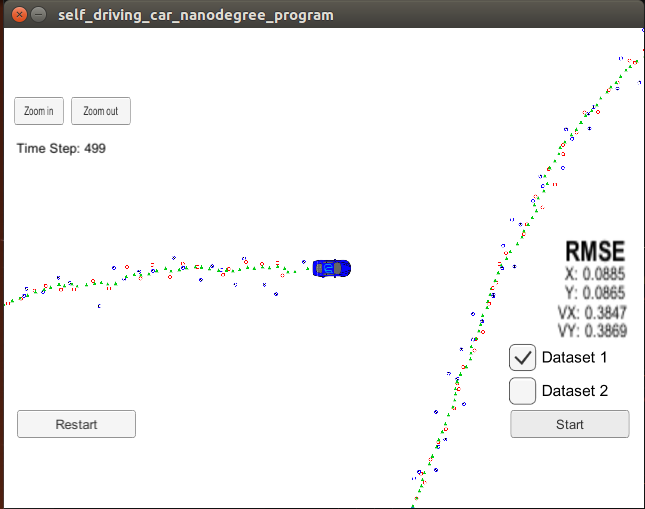
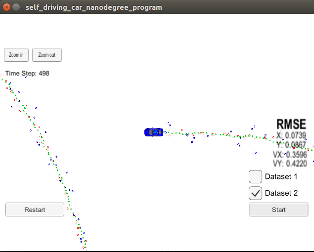
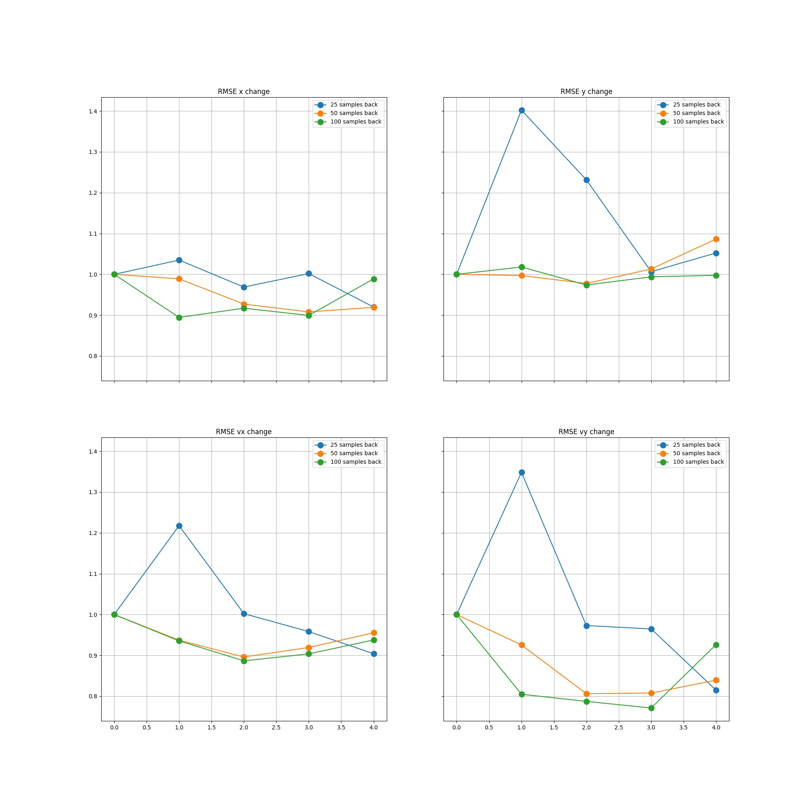

# Backward-Forward Smoothing Extended Kalman
Self-Driving Car Engineer Nanodegree Program

This project utilizes a Backward-smoothing Extended Kalman Filter to estimate the state of a moving object of interest with noisy lidar and radar sensors.

This project involves the Term 2 Simulator [here](https://github.com/udacity/self-driving-car-sim/releases)

# Description

The simulator simulates a car tracking system, using laser and a radar. The laser samples return location samples, while radar both location & velocity.

The EKF (Extended Kalman Filter) alone is able to maintain the estimate covirance low and correlatively, the RMSE low. Since the EKF has no time direction restriction, using the EKF with backward and forward passes, while linerizing about the new estimate at every pass, allos to further reduce the RMSE.

The backward-forward smoothing algorithm parameters are:

1. History length (50 samples)
2. Number of backward-forward sweeps (3 sweeps)

# Results

| Dataset #1  | Dataset #2 |
|---|---|
|  |  |

## RMSE

The final results are well within the allowed bounds - lower by at least 20%

| | RMSE x | RMSE y | RMSE vx | RMSE vy |
|---|---|---|---|---|
|Dataset #1 | 0.0885 | 0.0865 | 0.3847 | 0.3869 |
|Dataset #2 | 0.0739 | 0.0867 | 0.3596 | 0.4220 |
|Upper allowed bpund | 0.1100 | 0.1100 | 0.5200 | 0.5200 |

## Backward-forwad smoothing workpoint

The workpoint has been selected after reviewing the RMSE for 

* History - samples history of 0 (regular EKF), 25, 50, 100 samples
* Sweeps - how many backward-forward smoothing repetitions

From the figure below, the workpoint of 50 samples and 3 sweeps has been selected, as substantial improvement in x, Vx & Vy RMSE (10%, 10% & 20% respectively), while y RMSE showed a small statistically insignificant improvement.

## Evaluating Radar & Laser independently 

Turning off laser & radar was evaluated on dataset #1

It can be seen in the table, that the RMSE of every sensor alone, even with backward-forward smoothing, for the vast majority of parameters, is insufficient.

It can be noted that the laser only yields slightly better results. This is due to the fact that the Laser's noise standard deviation is 0.15 [m], while the Radar's noise, for range, is 0.3 [m].

| | RMSE x | RMSE y | RMSE vx | RMSE vy |
|---|---|---|---|---|
|Laser only | 0.179 | 0.154 | 0.646 | 0.502 |
|Radar only | 0.254 | 0.340 | 0.567 | 0.733 |
|Upper allowed bpund | 0.1100 | 0.1100 | 0.5200 | 0.5200 |

This analysis serves to show that the combined usage of both yields extremely better results.

# Code 

### Compile & run
1. mkdir build
2. cd build
3. cmake ..
4. make
5. ./ExtendedKF

### I/O

INPUT: values provided by the simulator to the c++ program

["sensor_measurement"] => the measurement that the simulator observed (either lidar or radar)

OUTPUT: values provided by the c++ program to the simulator

["estimate_x"] <= kalman filter estimated position x
["estimate_y"] <= kalman filter estimated position y
["rmse_x"]
["rmse_y"]
["rmse_vx"]
["rmse_vy"]

###  Dependencies

* cmake >= 3.5
  * All OSes: [click here for installation instructions](https://cmake.org/install/)
* make >= 4.1 (Linux, Mac), 3.81 (Windows)
  * Linux: make is installed by default on most Linux distros
  * Mac: [install Xcode command line tools to get make](https://developer.apple.com/xcode/features/)
  * Windows: [Click here for installation instructions](http://gnuwin32.sourceforge.net/packages/make.htm)
* gcc/g++ >= 5.4
  * Linux: gcc / g++ is installed by default on most Linux distros
  * Mac: same deal as make - [install Xcode command line tools](https://developer.apple.com/xcode/features/)
  * Windows: recommend using [MinGW](http://www.mingw.org/)

## Basic Build Instructions

1. Clone this repo.
2. Make a build directory: `mkdir build && cd build`
3. Compile: `cmake .. && make` 
4. Run`./ExtendedKF `
5. Run the simulator

# References

[1] [Smoothing Kalman Filter](http://jimbeck.caltech.edu/summerlectures/lectures/Kalman.pdf)
[2] [Kalman smoothing](http://arl.cs.utah.edu/resources/Kalman%20Smoothing.pdf)